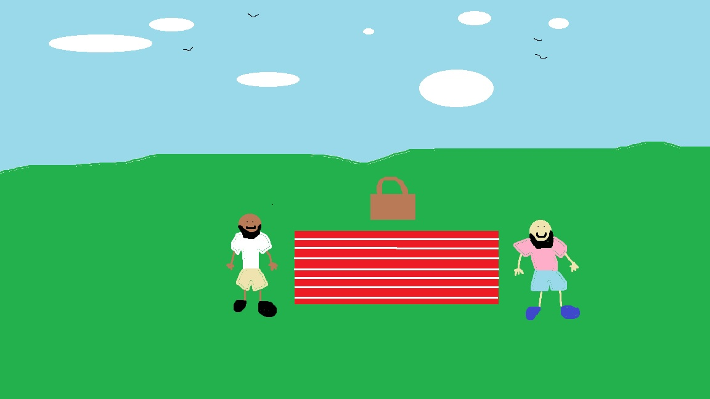

# TestProject
##Introduction##
I started this project as an initial way of learning more about front end web development.
I wanted to see what kinds of things a beginner could do using simple tools like Paint and VS Code. 

###Images###
I drew the following images using Microsoft Paint
An image of a beach 
An image of a park picnic 
An image of a mountain lake 

