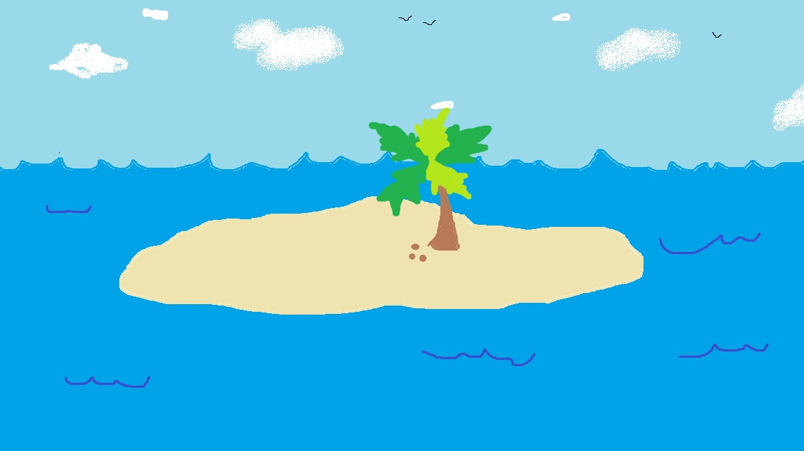
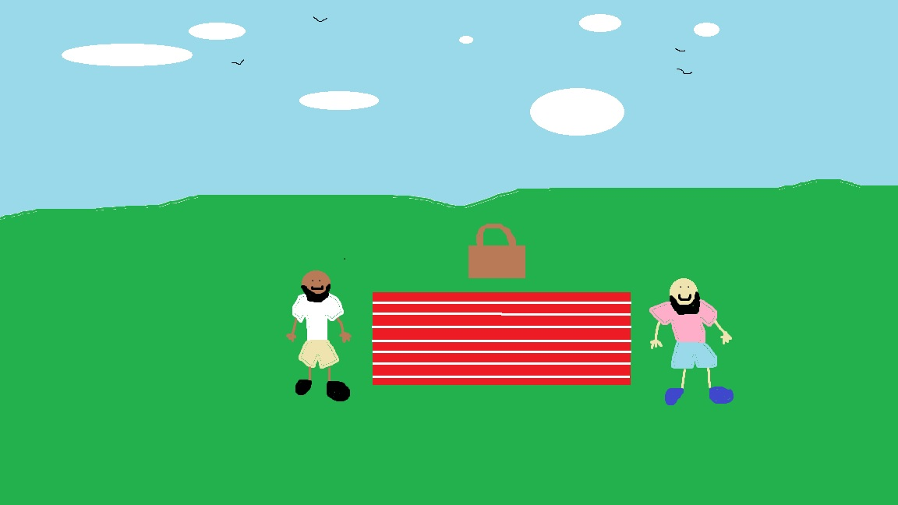
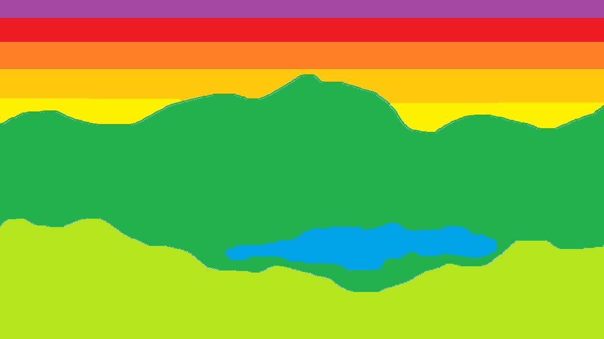

# Travel Game
## Introduction

I started this project as an initial way of learning more about front end web development.
I wanted to see what kinds of things a beginner could do using simple tools like *MS Paint* and *VS Code*. 

### Images

I drew the following images using Microsoft Paint

An image of a beach 

An image of a park picnic 

An image of a mountain lake 

#### Purpose
My initial goal was just to create _something_. It reminded me of beign a child and given Legos to play with. With simple building blocks you can use them to build something very fun and _unique_. The same is true for building web pages, I believe. With a little _*time*_, _*effort*_, and _*creativity*_, you can put together something very personal and entertaining. 
